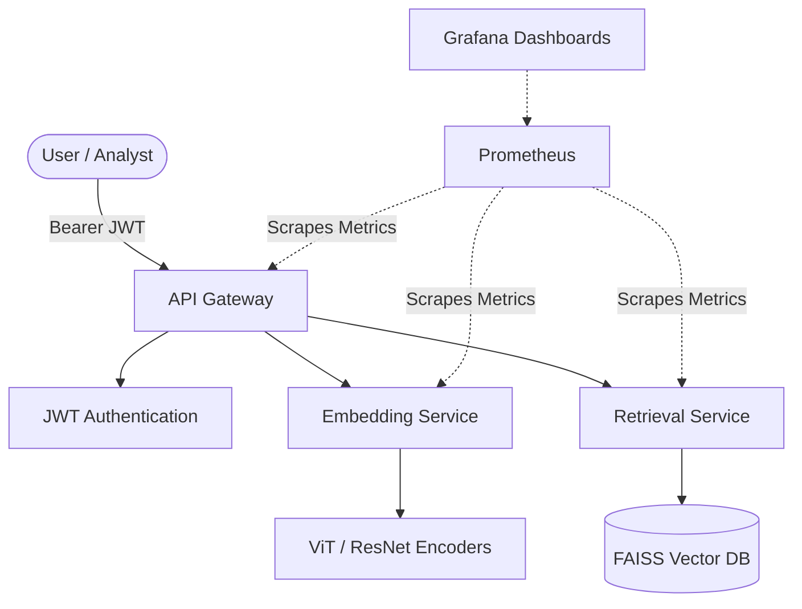

# GeoFusion AI Platform
### Enterprise Multi-Sensor Satellite Intelligence Retrieval Engine


GeoFusion AI is a research-grade, enterprise-ready geospatial intelligence platform. It enables **cross-modal satellite image retrieval** across optical, SAR, and multispectral sensors using shared embedding spaces, contrastive alignment, and FAISS indexing.

---

## 🔬 Mathematical Foundation

GeoFusion solves the cross-modal retrieval problem by hypothesizing that **images from different sensors observing the same geographic region should have nearby representations in a common latent space**.

### 1. Shared Embedding Space
Let \(x_o \in \mathbb{R}^{H \times W \times C_o}\) be an optical image and \(x_s \in \mathbb{R}^{H \times W \times C_s}\) be a SAR image.
Modality-specific encoders map these into a shared \(d\)-dimensional latent space:
\[z_o=f_o(x_o;\theta_o)\]
\[z_s=f_s(x_s;\theta_s)\]
where \(z_o,z_s \in \mathbb{R}^{d}\).

### 2. GeoFusion Theoretical Statement
The entire system is trained end-to-end to satisfy:
\[\min_{\theta_o,\theta_s} \sum_{i=1}^{N} D \left( f_o(x_o^i), f_s(x_s^i) \right)\]
subject to:
\[D \left( f_o(x_o^i), f_s(x_s^j) \right) > m, \quad i\neq j\]
*GeoFusion learns modality-invariant representations by minimizing the embedding distance between semantically corresponding observations while maximizing the distance between unrelated observations.*

### 3. Contrastive Learning Loss (InfoNCE)
For a positive pair \((z_o,z_s)\), the InfoNCE loss drives alignment:
\[L = -\log \frac{\exp(Sim(z_o,z_s)/\tau)}{\sum_{k=1}^{N} \exp(Sim(z_o,z_k)/\tau)}\]
where \(\tau\) is the temperature parameter, and \(Sim(z_i,z_j) = \frac{z_i \cdot z_j}{|z_i||z_j|}\).

### 4. Retrieval Complexity
Using a FAISS Approximate Nearest Neighbor (ANN) index reduces brute-force search complexity from \(O(Nd)\) to approximately \(O(\log N)\), enabling sub-50ms latency over millions of tiles.

---

## 🏗 Enterprise Architecture



### Key Enterprise Features
- **JWT Authentication:** Secure endpoints with Role-Based Access Control (RBAC).
- **CI/CD Pipeline:** Fully automated testing, linting (Black, Flake8), and Docker image building via GitHub Actions.
- **Observability:** Centralized structured JSON logging (structlog) and Prometheus metrics.
- **Data Versioning & Ingestion:** STAC API ingestion pipeline (Microsoft Planetary Computer) and DVC integration.
- **Experiment Tracking:** MLflow integration for model registry and metrics tracking.
- **Frontend Integration:** React frontend for querying the multi-modal satellite data.

---

## 🚀 Quick Start

### 1. Installation
```bash
git clone https://github.com/Tejaswanth2406/geofusion-platform.git
cd geofusion-platform
pip install -r requirements.txt
```

### 2. Start the Enterprise Stack
Runs API Gateway, Embedding Service, Retrieval Service, MLflow, Prometheus, and Grafana:
```bash
docker-compose up --build -d
```

### 3. Usage
**Authenticate:**
```bash
curl -X POST http://localhost:8000/auth/token \
  -H "Content-Type: application/json" \
  -d '{"username":"admin", "password":"geofusion_demo_2026"}'
```
*Extract the `access_token` from the response.*

**Cross-Modal Retrieval:**
```bash
curl -X POST http://localhost:8000/api/v1/retrieve \
  -H "Authorization: Bearer <YOUR_ACCESS_TOKEN>" \
  -F "sensor=optical" \
  -F "image=@data/sentinel2/tile001/image.tiff"
```

### 4. Data Ingestion (STAC API)
To fetch satellite imagery via Microsoft Planetary Computer STAC API:
```bash
python data-engineering/ingestion/stac_ingest.py --bbox -122.5 37.7 -122.3 37.8 --sensor optical --max_items 5
```

---

## 🌍 Production Deployment

The project architecture separates the UI from the microservice backend:
- **Frontend (React)**: Deployed automatically via **Vercel** for globally distributed edge serving and seamless CI/CD integration.
- **Backend (FastAPI)**: Hosted on **Render** (via Docker containers) to support Python-heavy dependencies, FAISS in-memory indexing, and deep learning libraries.

---

## 📂 Repository Structure
```text
geofusion-platform/
├── .github/workflows/ci.yml    # CI/CD Pipeline
├── backend/
│   ├── api-gateway/            # JWT Auth, Rate Limiting, Routing
│   ├── embedding-service/      # Torch encoders (ViT, ResNet)
│   ├── retrieval-service/      # FAISS Indexing
│   ├── training-service/       # Contrastive Losses, Distributed Training
│   ├── evaluation-service/     # F1@K, mAP metrics
│   └── preprocessing-service/  # Cloud masking, tiling
├── frontend/                   # React web application (Vercel deployment)
├── data-engineering/           # STAC ingestion pipelines
├── tests/                      # Pytest unit & integration tests
├── deployment/docker/          # Container definitions
├── monitoring/                 # Prometheus config & Grafana dashboards
├── mlflow/                     # Experiment tracking
└── vector-database/            # Persistent FAISS indices
```

---

## 📊 Evaluation Metrics
The platform continuously evaluates against validation sets using:
\[Precision@K = \frac{|\text{Relevant} \cap \text{Retrieved}@K|}{K}\]
\[Recall@K = \frac{|\text{Relevant} \cap \text{Retrieved}@K|}{|\text{Relevant}|}\]
\[F1@K = 2 \cdot \frac{Precision@K \times Recall@K}{Precision@K+Recall@K}\]

---

**BAH 2026 Hack2Skill** • MIT License
